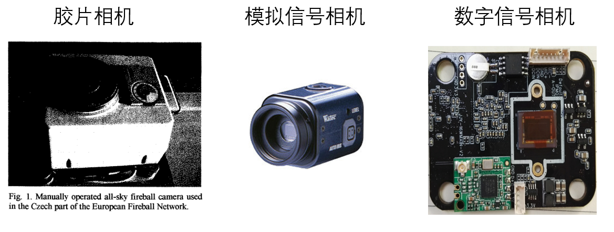
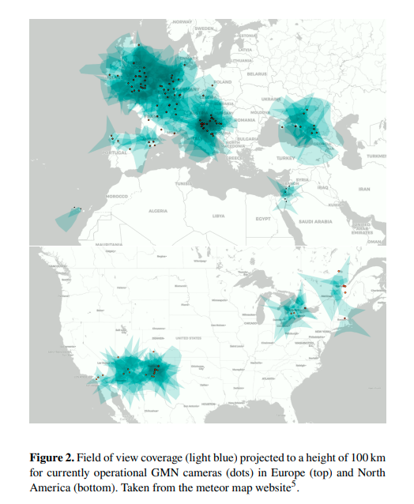
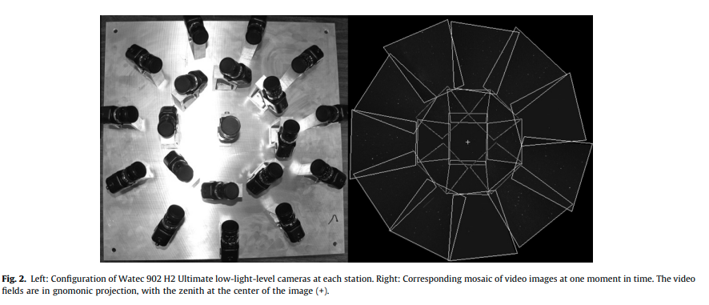
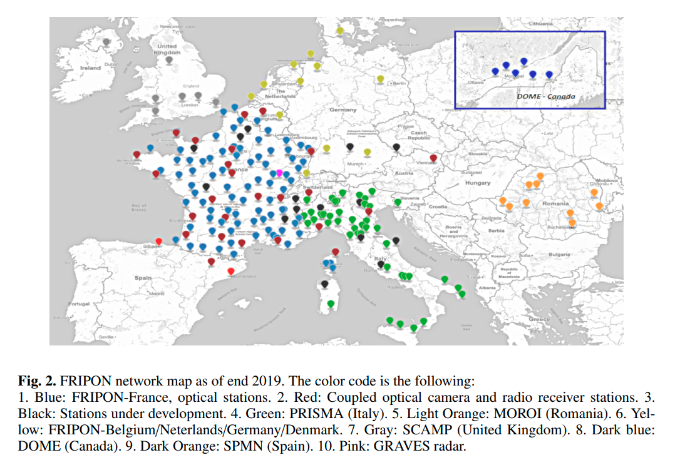
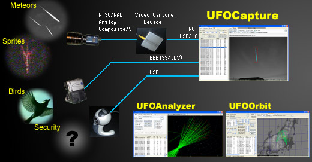
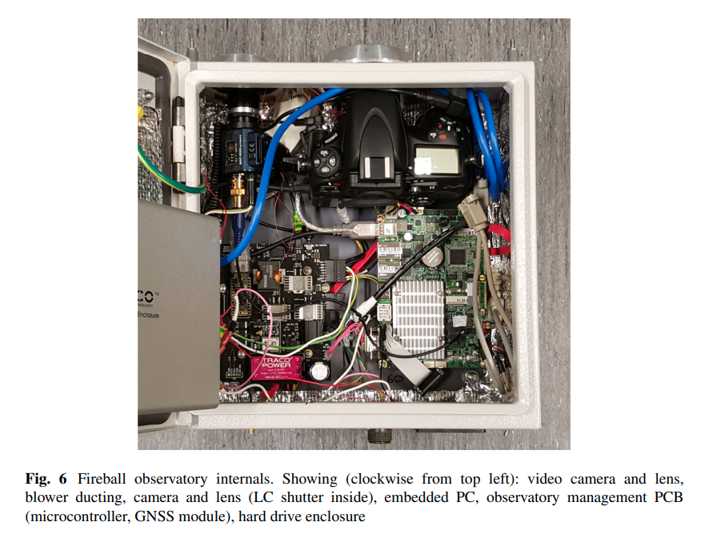
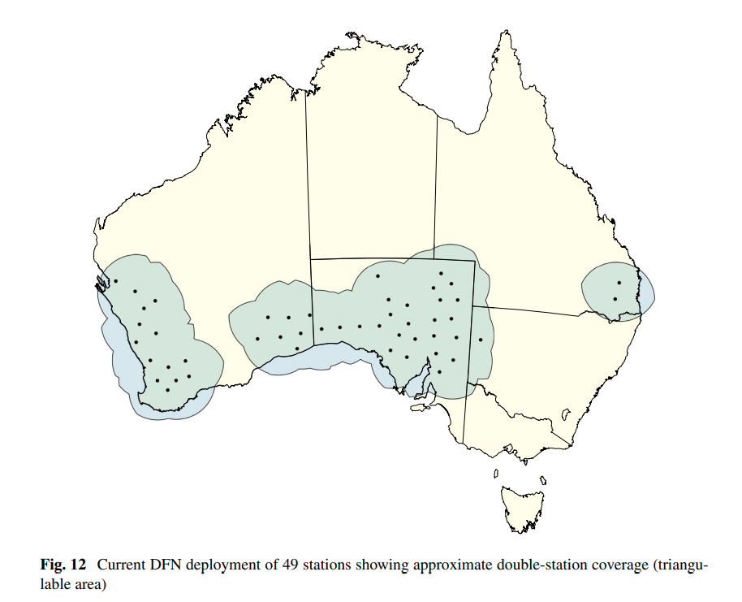

# 世界上的流星监测网络

自60年代开始，世界各地曾经有许多流星监测网络，尤其在90-00年代，在加拿大、北美、日本和欧洲都有流星检测网在运行。流星监测网使用的相机也从胶片相机[^1]发展到模拟信号相机再到数字信号相机，分辨率和精度逐步提升。时至今日，世界上正在活跃的流星监测网络有GMN、CAMS、FRIPON等。

  

这篇文章来自于我粗浅的文献调研，显然并不完整，对每个流星监测网络的描述也不一定是最新的，请不吝指出。其中有比较有趣的网络，例如澳大利亚沙漠火流星监测网，会单独写一遍文章来介绍。

## GMN[^2]

GMN（Global meteor network）是现在规模最大的流星监测网络。项目2018年由Croatian Meteor Network为前身发起。项目的核心是使用开源硬件和软件建设低成本的流星监测站。网络使用树莓派和IMX290、IMX255等芯片的网络摄像头，配合为之开发的开源软件（RMS），可以实现低成本和快速推广。软件同时也输出兼容CAMS和UFO Orbit的数据。至2021年，网络包含20个国家的共450个站点，共获得220000条流星轨道。

  

## CAMS[^3]

CAMS（California All-sky Meteor Surveillance System）是一个历史较为悠久的流星监测网，开始于2000年前后。在2010年，CAMS推出了新的相机硬件设计，使用多个模拟信号摄像头组成阵列覆盖全天，每个摄像头的分辨率为22°×29°。数据格式使用Croatian Meteor Network开发的压缩格式。观测时将整夜的数据进行压缩存盘，再一同处理。

  

## FRIPON[^4]
FRIPON（Fireball Recovery and InterPlanetary Observation Network）是主要活跃于欧洲的流星监测网络。至2020年，已经有105个光学站点和25个无线电站点。硬件方面也使用低成本计算机和网络摄像头，使用鱼眼相机覆盖全天。软件方面使用单独开发的Freeture探测流星。由于硬件限制，极限星等不高，专注于较亮的火流星。至2020年，探测到4000颗流星。

  

  

## UFOCAPTURE[^5]
SonotaCo是一个日本的资深爱好者，开发了著名的UFOCapture软件，被诸多小型流星监测网和爱好者使用。但这个软件是闭源收费软件，因此也造成大型流星监测网都使用独立开发的开源软件。这些软件的性能经常与UFO软件相对比。配套的UFOOrbit软件是免费的，因此更广泛地应用于流星定轨，很多流星监测网也提供兼容的数据产品。

  

## DFN[^6]

澳大利亚沙漠火流星监测网（Australian Desert Fireball Network）是专注于寻找陨石的火流星监测网络，与其他使用视频摄像头的网络不通，DFN使用单反相机和液晶快门进行流星监测。虽然无法探测暗流星，但足够进行火流星和陨石轨迹的观测。2015和2016年各找到一颗1公斤级的陨石。

* 详细解读：[澳大利亚沙漠火流星监测网](DFN.md)

  

  

## 一些不活跃的流星网

* IMONET：至2014年，有450000条流星数据
* SLOVAK VIDEO METEOR NETWORK：使用像增强器，极限星等很高，但成本也很高，只有两个站点
* North American Meteor Network：爱好者组织，没有成果发表
* Tokyo Meteor Network：活跃于90年代
* Mexican Meteor Network：一个2016年提出的计划，依然采用模拟信号摄像头，有些落后时代
* Sri Lanka Meteor Network：没有成果发表
* ASGARD All-Sky Camera Network：加拿大的5个站点，使用模拟信号摄像头，极限星等+1

[^1]:[The autonomous all-sky photographic camera for meteor observation](https://ui.adsabs.harvard.edu/abs/2002ESASP.500..257S/abstract)

[^2]:[The Global Meteor Network -- Methodology and First Results](https://arxiv.org/abs/2107.12335)

[^3]:[CAMS: Cameras for Allsky Meteor Surveillance to establish minor meteor showers](https://www.sciencedirect.com/science/article/pii/S0019103511003290)

[^4]:[FRIPON: A worldwide network to track incoming meteoroids](https://www.aanda.org/articles/aa/full_html/2020/12/aa38649-20/aa38649-20.html)

[^5]:[SonotaCo - UFOCapture](http://sonotaco.com/soft/e_index.html)

[^6]:[How to build a continental scale fireball camera network](https://link.springer.com/article/10.1007/s10686-017-9532-7)

